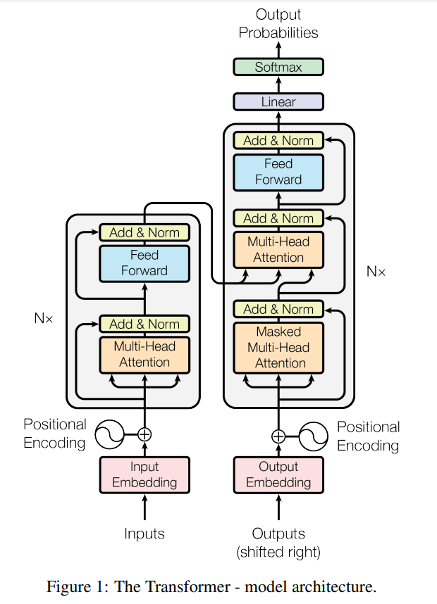

# 数据准备
参考： https://awslabs.github.io/sockeye/tutorials/wmt_large.html  
本工程中直接执行`datas/*`内部的`get_data*.sh`

# 网络结构
原文： https://arxiv.org/abs/1706.03762  
## 结构图：
<!--  -->

## Encoder

$d_{model}x_{1^2_{3^4_{5^6_{7}}}}$

$\sum_{k=1}^\infty\frac{x^n}{n!}$ = $\int_0^\infty e^x$

$\sum\limits_{k=1}^n$ 和 $\sum\nolimits_{k=1}^n$

$$
\hat{a}
\check{a}
\breve{a}
\tilde{a}
\bar{a}
\vec{a}
\acute{a}
\grave{a}
\mathring{a}
\dot{a}
\ddot{a}
$$

A &rarr; B

